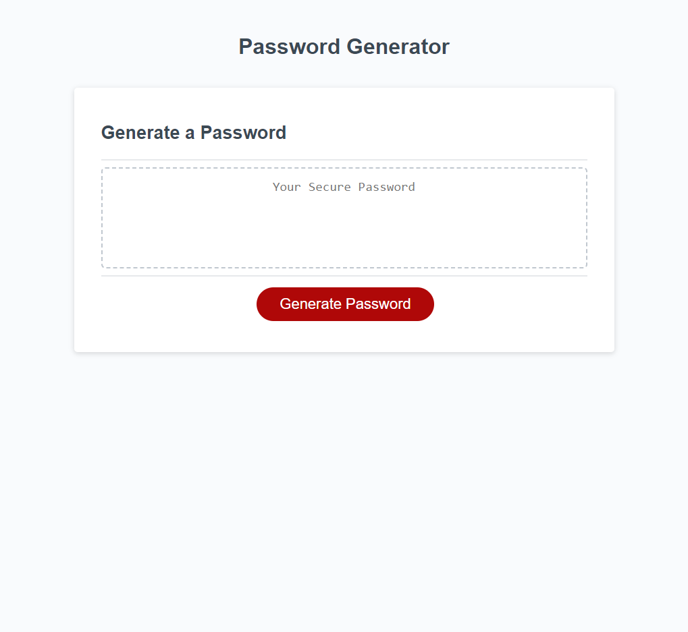

# 03-JavaScript-Password-Generator
Password Generator

## Description 
This challenge was completed to create a password generator. It was created to randomly generate a password that meets certain criteria and provides a strong password that provides greater security. 

## Link to application
https://gioq89.github.io/03-JavaScript-Password-Generator/

## Screenshot

## Usage 
To use this assignment, click on generate password to be presented with a series of prompts. Once you confirm your selections, a password will generate based off your selections. 

## Credits N/A

## License N/A
